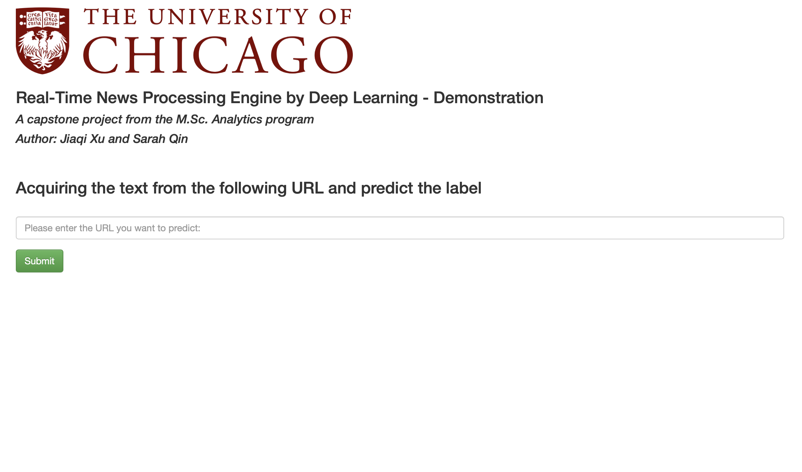
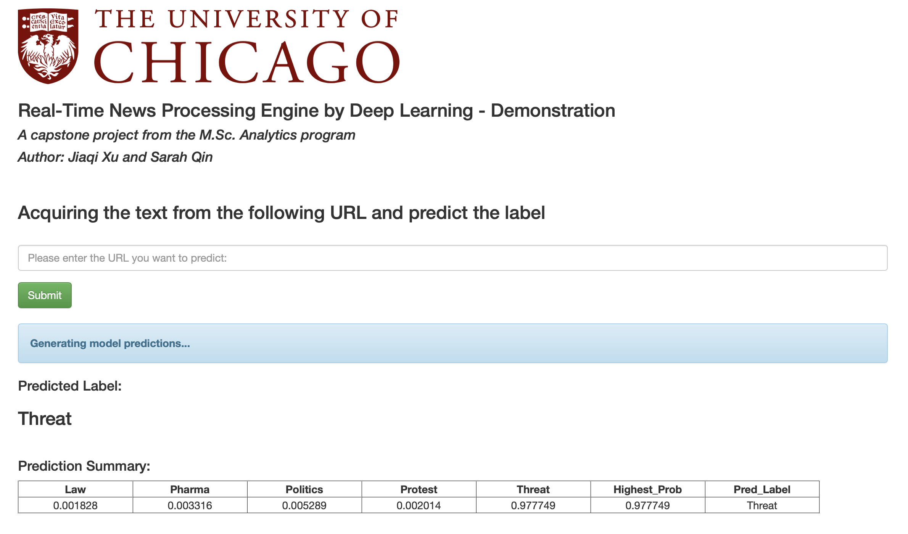

# Real-Time-News-Processing-Engine

A capstone project from the M.Sc. Analytics program at the University of Chicago

## Summary

This Flask app is an UI that allows user to input an URL and present the label prediction and corresponding probability.

### Initial Page


### Model Result


## Latest version bug fixs

Solved model loading issue under tensorflow 2.0 and Keras 2.3 by using 
```
from tensorflow.kerea.models import load_model
```
